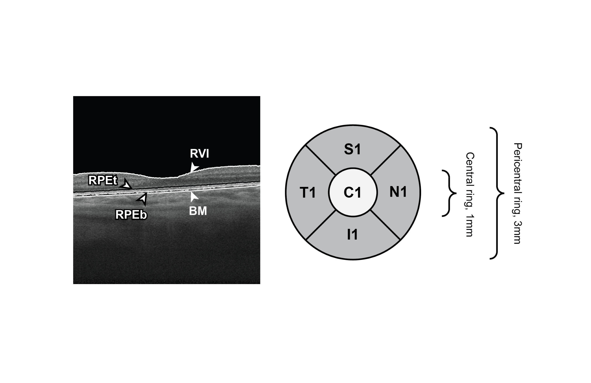

# segPLEX
The algorithm is designed to be executed following the execution of 'convertPLEX' (https://github.com/cnzakimuena/convertPLEX).  Similarly as with 'convertPLEX', all previously processed folders containing all files (e.g. ‘SamplePatient_01’, ‘SamplePatient_02’, etc.) should be inserted into 'processed' folder, which should be located inside the current directory.<br/> 
The segmentation of PLEX Elite 9000 retinal B-scan (size 3mm x 3mm) retinal-vitreous interface (RVI), top and bottom retinal pigment epithelium (RPE), and Bruch’s membrane (BM) is provided.  Two image segmentation algorithms are featured.  The first consists of a cross-sectional pre-segmentation using A-scan gradients and an implementation of Dijkstra's shortest path algorithm [1].  The second approach is a refinement of the pre-segmentation and involves a graph-cuts algorithm [2].  The segmentation algorithms were previously described and implemented on OCT images generated using a different device [3].<br/>
An algorithm for structuring data into an Early Treatment Diabetic Retinopathy Study (ETDRS) grid [4] is also provided.<br/> 

[1] G. Gallo and S. Pallottino, "Shortest path algorithms," Annals of operations research, vol. 13, no. 1, pp. 1-79, 1988.<br/> 
[2] K. Li, X. Wu, D. Z. Chen, and M. Sonka, "Optimal surface segmentation in volumetric images-a graph-theoretic approach," IEEE transactions on pattern analysis and machine intelligence, vol. 28, no. 1, pp. 119-134, 2006.<br/>
[3] J. Mazzaferri, L. Beaton, G. Hounye, D. N. Sayah, and S. Costantino, "Open-source algorithm for automatic choroid segmentation of OCT volume reconstructions," Scientific reports, vol. 7, p. 42112, 2017.<br/>
[4] E. R. Group, "Classification of diabetic retinopathy from fluorescein angiograms," ETDRS report 1991.<br/>

usage:

```matlab
call_segPLEX()
```

Cite As

Bélanger Nzakimuena, C. (2020). Automated Analysis of Retinal and Choroidal OCT and OCTA Images in AMD (Masters thesis, Polytechnique Montréal). Retrieved from https://publications.polymtl.ca/5234/<br/>
Bélanger Nzakimuena, C., Marcotte-Collard, R., & Simard, P. (2020). An algorithm for structuring data into an Early Treatment Diabetic Retinopathy Study (ETDRS) grid (https://github.com/cnzakimuena/segPLEX), GitHub.[Month and Day Retrieved], [Year Retrieved]. 


